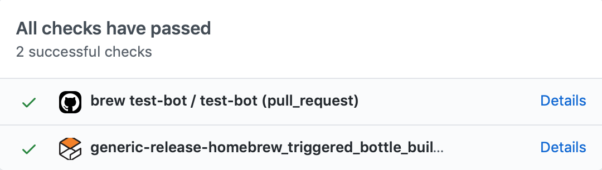

Build | Status
-- | --
macOS 10.15 GitHub action | [)

homebrew-simulation
===================

Homebrew tap for osrf simulation software

To use:

    brew tap osrf/simulation
    brew install ignition-citadel

## Bottle status

### Ignition Edifice

*            [ignition_cmake2](https://build.osrfoundation.org/view/ign-edifice/job/ignition_cmake2-install_bottle-homebrew-amd64/)
*            [ignition_tools1](https://build.osrfoundation.org/view/ign-edifice/job/ignition_tools1-install_bottle-homebrew-amd64/)
*            [ignition_utils1](https://build.osrfoundation.org/view/ign-edifice/job/ignition_utils1-install_bottle-homebrew-amd64/)
*              [ignition_math6](https://build.osrfoundation.org/view/ign-edifice/job/ignition_math6-install_bottle-homebrew-amd64/)
*          [ignition_common4](https://build.osrfoundation.org/view/ign-edifice/job/ignition_common4-install_bottle-homebrew-amd64/)
*              [ignition_msgs7](https://build.osrfoundation.org/view/ign-edifice/job/ignition_msgs7-install_bottle-homebrew-amd64/)
*  [ignition_fuel-tools6](https://build.osrfoundation.org/view/ign-edifice/job/ignition_fuel-tools6-install_bottle-homebrew-amd64/)
*          [ignition_plugin1](https://build.osrfoundation.org/view/ign-edifice/job/ignition_plugin1-install_bottle-homebrew-amd64/)
*  [ignition_transport10](https://build.osrfoundation.org/view/ign-edifice/job/ignition_transport10-install_bottle-homebrew-amd64/)
*                                       [sdformat11](https://build.osrfoundation.org/job/sdformat11-install_bottle-homebrew-amd64/)
*        [ignition_physics4](https://build.osrfoundation.org/view/ign-edifice/job/ignition_physics4-install_bottle-homebrew-amd64/)
*    [ignition_rendering5](https://build.osrfoundation.org/view/ign-edifice/job/ignition_rendering5-install_bottle-homebrew-amd64/)
*                [ignition_gui5](https://build.osrfoundation.org/view/ign-edifice/job/ignition_gui5-install_bottle-homebrew-amd64/)
*        [ignition_sensors5](https://build.osrfoundation.org/view/ign-edifice/job/ignition_sensors5-install_bottle-homebrew-amd64/)
*          [ignition_gazebo5](https://build.osrfoundation.org/view/ign-edifice/job/ignition_gazebo5-install_bottle-homebrew-amd64/)
*          [ignition_launch4](https://build.osrfoundation.org/view/ign-edifice/job/ignition_launch4-install_bottle-homebrew-amd64/)
*          [ignition_edifice](https://build.osrfoundation.org/view/ign-edifice/job/ignition_edifice-install_bottle-homebrew-amd64/)

### Ignition Dome

*            [ignition_cmake2](https://build.osrfoundation.org/view/ign-dome/job/ignition_cmake2-install_bottle-homebrew-amd64/)
*            [ignition_tools1](https://build.osrfoundation.org/view/ign-dome/job/ignition_tools1-install_bottle-homebrew-amd64/)
*              [ignition_math6](https://build.osrfoundation.org/view/ign-dome/job/ignition_math6-install_bottle-homebrew-amd64/)
*          [ignition_common3](https://build.osrfoundation.org/view/ign-dome/job/ignition_common3-install_bottle-homebrew-amd64/)
*              [ignition_msgs6](https://build.osrfoundation.org/view/ign-dome/job/ignition_msgs6-install_bottle-homebrew-amd64/)
*  [ignition_fuel-tools5](https://build.osrfoundation.org/view/ign-dome/job/ignition_fuel-tools5-install_bottle-homebrew-amd64/)
*          [ignition_plugin1](https://build.osrfoundation.org/view/ign-dome/job/ignition_plugin1-install_bottle-homebrew-amd64/)
*    [ignition_transport9](https://build.osrfoundation.org/view/ign-dome/job/ignition_transport9-install_bottle-homebrew-amd64/)
*                                       [sdformat10](https://build.osrfoundation.org/job/sdformat10-install_bottle-homebrew-amd64/)
*        [ignition_physics3](https://build.osrfoundation.org/view/ign-dome/job/ignition_physics3-install_bottle-homebrew-amd64/)
*    [ignition_rendering4](https://build.osrfoundation.org/view/ign-dome/job/ignition_rendering4-install_bottle-homebrew-amd64/)
*                [ignition_gui4](https://build.osrfoundation.org/view/ign-dome/job/ignition_gui4-install_bottle-homebrew-amd64/)
*        [ignition_sensors4](https://build.osrfoundation.org/view/ign-dome/job/ignition_sensors4-install_bottle-homebrew-amd64/)
*          [ignition_gazebo4](https://build.osrfoundation.org/view/ign-dome/job/ignition_gazebo4-install_bottle-homebrew-amd64/)
*          [ignition_launch3](https://build.osrfoundation.org/view/ign-dome/job/ignition_launch3-install_bottle-homebrew-amd64/)
*                [ignition_dome](https://build.osrfoundation.org/view/ign-dome/job/ignition_dome-install_bottle-homebrew-amd64/)

### Ignition Citadel

*            [ignition_cmake2](https://build.osrfoundation.org/view/ign-citadel/job/ignition_cmake2-install_bottle-homebrew-amd64/)
*            [ignition_tools1](https://build.osrfoundation.org/view/ign-citadel/job/ignition_tools1-install_bottle-homebrew-amd64/)
*              [ignition_math6](https://build.osrfoundation.org/view/ign-citadel/job/ignition_math6-install_bottle-homebrew-amd64/)
*          [ignition_common3](https://build.osrfoundation.org/view/ign-citadel/job/ignition_common3-install_bottle-homebrew-amd64/)
*              [ignition_msgs5](https://build.osrfoundation.org/view/ign-citadel/job/ignition_msgs5-install_bottle-homebrew-amd64/)
*  [ignition_fuel-tools4](https://build.osrfoundation.org/view/ign-citadel/job/ignition_fuel-tools4-install_bottle-homebrew-amd64/)
*          [ignition_plugin1](https://build.osrfoundation.org/view/ign-citadel/job/ignition_plugin1-install_bottle-homebrew-amd64/)
*    [ignition_transport8](https://build.osrfoundation.org/view/ign-citadel/job/ignition_transport8-install_bottle-homebrew-amd64/)
*                                         [sdformat9](https://build.osrfoundation.org/job/sdformat9-install_bottle-homebrew-amd64/)
*        [ignition_physics2](https://build.osrfoundation.org/view/ign-citadel/job/ignition_physics2-install_bottle-homebrew-amd64/)
*    [ignition_rendering3](https://build.osrfoundation.org/view/ign-citadel/job/ignition_rendering3-install_bottle-homebrew-amd64/)
*                [ignition_gui3](https://build.osrfoundation.org/view/ign-citadel/job/ignition_gui3-install_bottle-homebrew-amd64/)
*        [ignition_sensors3](https://build.osrfoundation.org/view/ign-citadel/job/ignition_sensors3-install_bottle-homebrew-amd64/)
*          [ignition_gazebo3](https://build.osrfoundation.org/view/ign-citadel/job/ignition_gazebo3-install_bottle-homebrew-amd64/)
*          [ignition_launch2](https://build.osrfoundation.org/view/ign-citadel/job/ignition_launch2-install_bottle-homebrew-amd64/)
*          [ignition_citadel](https://build.osrfoundation.org/view/ign-citadel/job/ignition_citadel-install_bottle-homebrew-amd64/)

## To build bottles

The https://build.osrfoundation.org jenkins instance is used for building bottles with the following job
(configured in [brew_release.dsl](https://github.com/ignition-tooling/release-tools/blob/master/jenkins-scripts/dsl/brew_release.dsl)):

*  https://build.osrfoundation.org/job/generic-release-homebrew_triggered_bottle_builder/

This jenkins job is triggered for pull requests when an administrator makes a comment
on the pull request that includes the phrase `build bottle`.
The job should appear in the GitHub build status interface for the latest commit:

For example, [#1157](https://github.com/osrf/homebrew-simulation/pull/1157) was created after
running our [release.py](https://github.com/ignition-tooling/release-tools/blob/master/release.py) script
and [this comment](https://github.com/osrf/homebrew-simulation/pull/1157#issuecomment-698111311)
triggered the bottle build, resulting in a successful bottle upload and [a4793387](https://github.com/osrf/homebrew-simulation/commit/a47933878a7e073225acf5ceef0960cd6cfd50b2).

Bottle builds are not triggered automatically for every pull request for several reasons:

* Not all pull requests require a bottle to be rebuilt (such as
  [#1007](https://github.com/osrf/homebrew-simulation/pull/1007) that added this text to the README)
* Successful bottle builds result in binary artifacts being immediately uploaded to our hosting provider
  so pull requests should be screened for malicious intent by administrators before triggering
  a bottle build.
    - This process differs from the approach taken by
      [homebrew/homebrew-core](https://github.com/Homebrew/homebrew-core)
      whose bottles are hosted at Bintray, which has a
      [different publishing mechanism](https://www.jfrog.com/confluence/display/BT/Managing+Uploaded+Content#ManagingUploadedContent-Publishing)
      than s3.
      Files uploaded to Bintray are not immediately available for public download;
      they must first be published.
      If they are not published within 7 days of upload, they are automatically deleted.
      The homebrew-core CI jobs will build bottles for any incoming pull request,
      which will upload bottles directly to bintray, but these bottles will not be
      publicly available unless the pull request is merged by a homebrew maintainer
      within 7 days.

## Troubleshooting

* Does a new bottle need to be built for every homebrew pull request?
    - A new bottle is not needed for all pull requests.
      For example, updates to documentation or a formula's `test do` block do not change
      the installed binary and thus don't require a new bottle.
      Changing the tarball `url`, adding patches, or bumping the formula `revision` do
      require new bottles.
      If you aren't sure, just ask in the pull request.

* Do I need to wait for the `brew test-bot / test-bot` GitHub action to succeed for starting a bottle build?
    - No, you don't need to wait. You can start the bottle build as soon as the pull request is opened.

* When can I merge a pull request? Does CI need to be finished?
    - Yes, CI must be finished and successful. If a new bottle is needed, the
      `generic-release-homebrew_triggered_bottle_builder` job must be successful as well.

* I commented `build bottle`, but it did not start a
  [generic-release-homebrew\_triggered\_bottle\_builder](https://build.osrfoundation.org/job/generic-release-homebrew_triggered_bottle_builder)
  job.
    - Confirm that the [build.osrfoundation.org](https://build.osrfoundation.org) web page loads.
      If it is not accessible, an OSRF build farmer should be notified.
    - If [build.osrfoundation.org](https://build.osrfoundation.org) is operational,
      confirm that you have adequate permissions.
      Currently, you must be a member of the [github.com/ignitionrobotics](https://github.com/ignitionrobotics)
      org in order to use the `build bottle` trigger phrase (see configuration in
      [brew_release.dsl](https://github.com/ignition-tooling/release-tools/blob/2ae0424303a5/jenkins-scripts/dsl/brew_release.dsl#L181-L185)).

* I'm updating a Formula to build from a specific commit in a git repository.
How do I get the `sha256` for the tarball corresponding to that commit?
    - First, make sure that you have updated the [url](https://github.com/osrf/homebrew-simulation/blob/376e1f471ba492a936e088596dc365f2bec43798/Formula/ignition-sensors5.rb#L4) to use the commit hash that corresponds to the commit in the repository that you'd like to use.
Also be sure to update the [version](https://github.com/osrf/homebrew-simulation/blob/376e1f471ba492a936e088596dc365f2bec43798/Formula/ignition-sensors5.rb#L5), if it exists (in the example linked here, `20201028~c02cd0` is the part that needs to be modified: `20201028` is the date (year-month-day), and `c02cd0` is the first 6 characters of the commit was used in the updated url).
    - Now, run the command `wget <url>`, where `<url>` is the updated url that was just mentioned.
Once you have the `tar` file downloaded, run the command `sha256sum <file>`, replacing `<file>` with the file that was downloaded via `wget`.
The `sha256` will be printed to the console, which can then be used to update the Formula's [sha256](https://github.com/osrf/homebrew-simulation/blob/376e1f471ba492a936e088596dc365f2bec43798/Formula/ignition-sensors5.rb#L6).

* I ran the [release.py](https://github.com/ignition-tooling/release-tools/blob/master/release.py) script multiple
  times for the same release and commented `build bottle` on the pull request, but the bottle building job failed,
  with console output containing the text `Warning: Formula reports different SHA256:`.
    - It's possible that the tarball uploaded at the time the pull request was created was overwritten
      by a subsequent call to `release.py` (see [ignition-tooling/release-tools#274](https://github.com/ignition-tooling/release-tools/issues/274)).
      If so, update the `sha256` field for the tarball (see [#1156](https://github.com/osrf/homebrew-simulation/pull/1156)
      and [57fa5defcce](https://github.com/osrf/homebrew-simulation/commit/57fa5defcce) for an example).

## Jenkins implementation details

The [generic-release-homebrew\_triggered\_bottle\_builder](https://build.osrfoundation.org/job/generic-release-homebrew_triggered_bottle_builder)
jenkins job currently builds bottles for macOS 10.13 `high_sierra` and 10.14 `mojave`
using the following job configurations and the
[homebrew\_bottle\_creation.bash](https://github.com/ignition-tooling/release-tools/blob/master/jenkins-scripts/lib/homebrew_bottle_creation.bash)
script:

*  https://build.osrfoundation.org/job/generic-release-homebrew_triggered_bottle_builder/label=osx_highsierra
*  https://build.osrfoundation.org/job/generic-release-homebrew_triggered_bottle_builder/label=osx_mojave

If the bottle building job finishes without errors for each build configuration,
it will trigger a subsequent [repository\_uploader\_packages](https://build.osrfoundation.org/job/repository_uploader_packages/)
job that uploads the bottles to s3
and a [generic-release-homebrew\_pr\_bottle\_hash\_updater](https://build.osrfoundation.org/job/generic-release-homebrew_pr_bottle_hash_updater/)
job that commits the changes in bottle `sha256` values to the pull request branch
using [this script](https://github.com/ignition-tooling/release-tools/blob/master/jenkins-scripts/lib/homebrew_bottle_pullrequest.bash).
